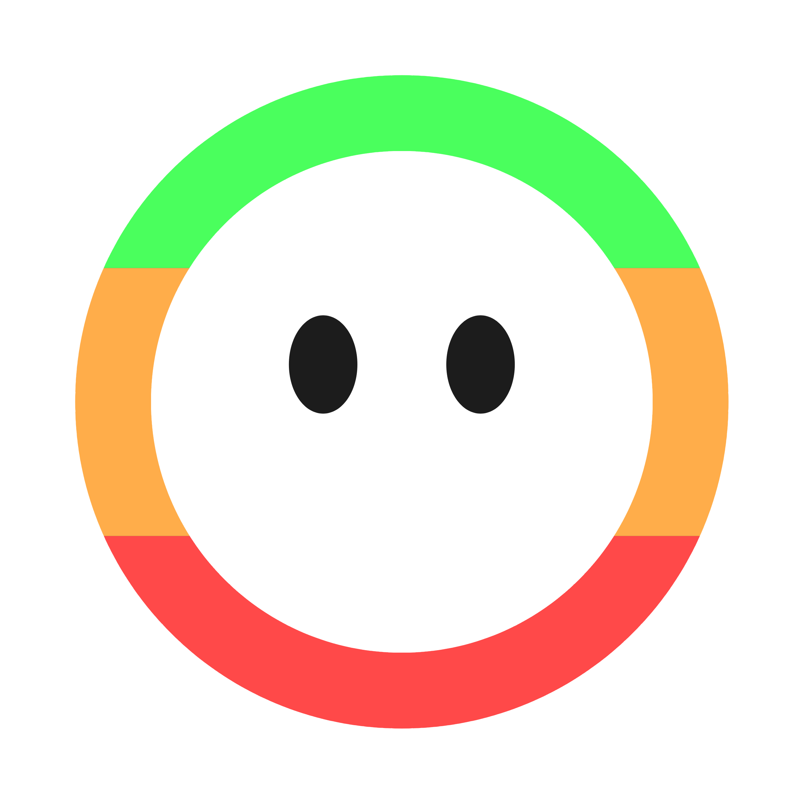
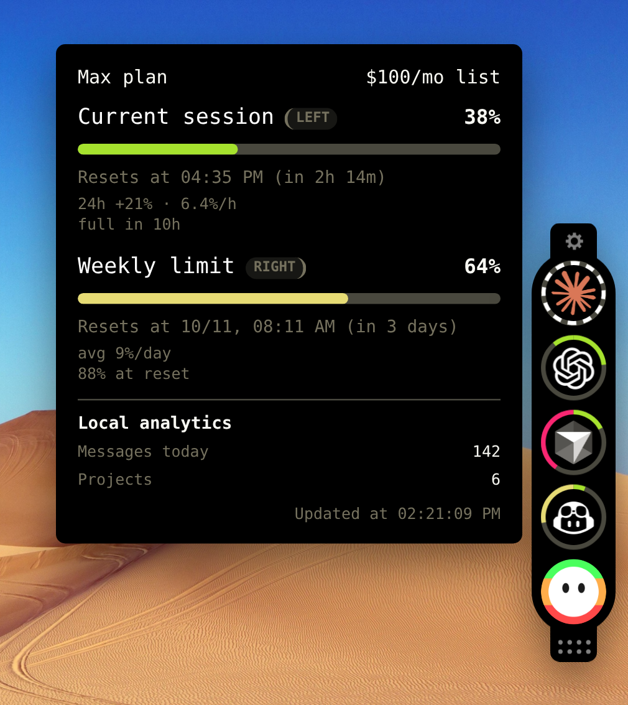
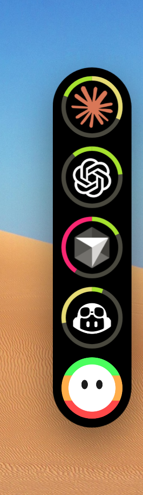
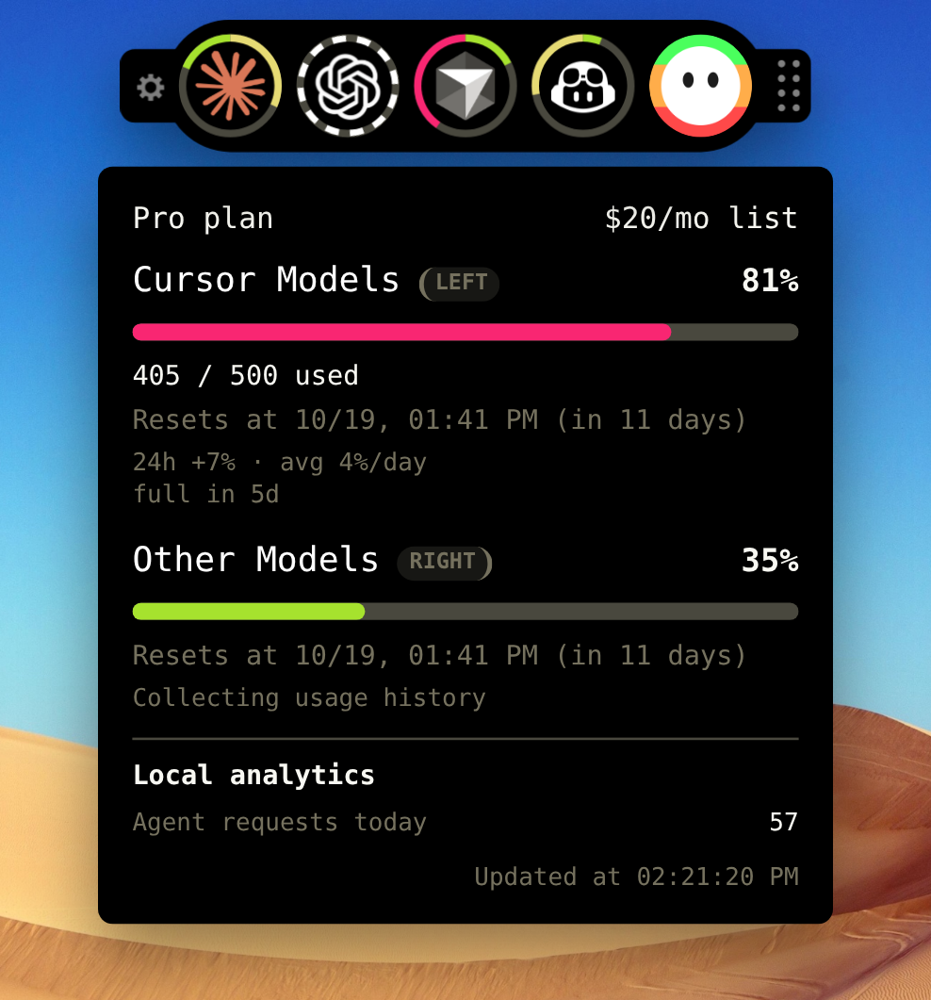
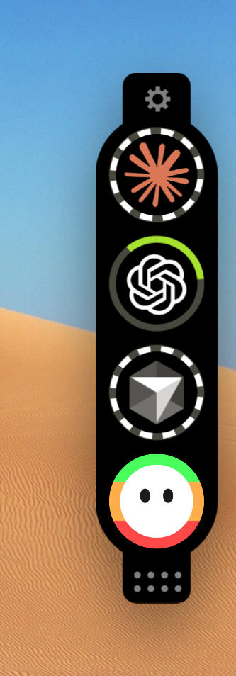
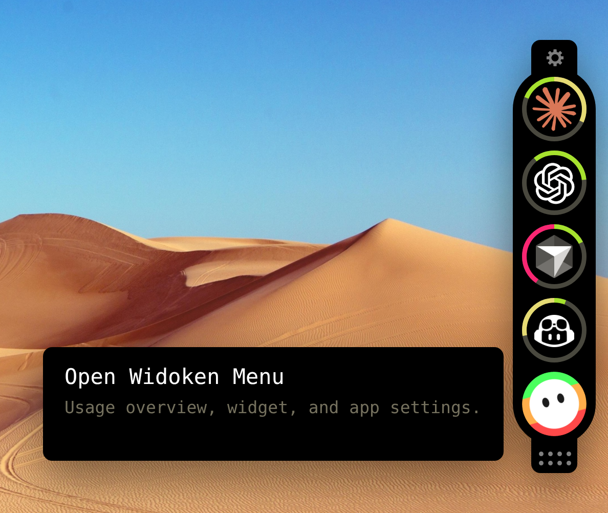
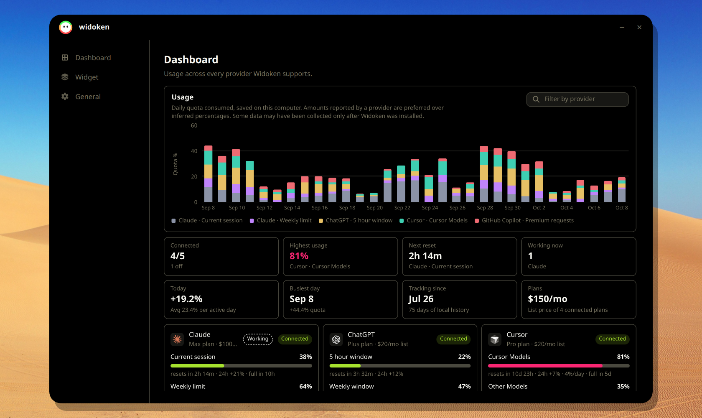
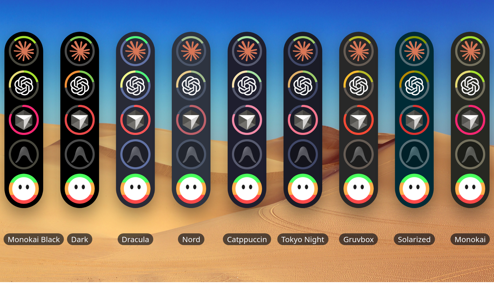

  

<h1 align="center">widoken</h1>

<strong>Your AI usage, living on the edge of the screen.</strong>

  Other tools hide your limits in a tab, a status bar, or a page you never open. 
  widoken stays on the desktop. Always. Without stealing a single click.

  

## Why it exists

You already pay for more than one AI. Claude for the long work. ChatGPT for the rest. Cursor when you are inside the editor. Copilot in the gaps.

Each one keeps its own meter in its own house. You find out you are empty when the model says no.

widoken puts every meter on the glass. The widget is the product. Everything else is there so the widget can stay small.

## This is the product

A slim strip docks to the side of your screen. Each icon is a provider. Each ring is a limit you can read from across the room.

Two limits can live on the same icon: session on the left, week on the right. You do not open anything to know where you stand.

  

Editors show one provider. Sites show another. Nothing else puts all of them on your desktop, in the same place you already look, without covering the work.

## Every provider on the same strip

widoken watches the tools you already signed into.

| | What you see |
| --- | --- |
| **Claude** | Session and weekly limits, together on one ring |
| **ChatGPT** | The short window and the weekly window |
| **Cursor** | Cursor Models and Other Models, with the real counts when Cursor sends them |
| **GitHub Copilot** | Premium requests and chat, only after you turn it on |
| **Antigravity** | Gemini and partner-model quotas from the local Antigravity session |

You choose who appears. A provider that is off is not watched. Turn it on when you want it there; turn it off and widoken stops looking.

Signed out, unavailable, or in error — the icon stays, so you can see that too.

## One hover. The whole story.

The rings are the glance. Point at an icon and the rest arrives beside the widget:

- how full each limit is
- when it resets
- what the last day cost you
- how fast you are burning
- when you will run out
- the plan you are on, and what it lists for
- the small local numbers, like messages or agent turns today

You never leave the work. You just point at the icon.

  

## You will see the work happening

While an agent is mid-turn, the ring comes alive. Claude thinking. Cursor still in a prompt. The widget itself tells you someone is working.

No extra window. No pile of notifications. When the turn ends, the usage updates.

  

## Put it where your hand already is

The widget is not a window you park. It belongs to the edge of the screen.

- **Any side.** Left, right, top, or bottom. Drag it. It snaps when you want it to, and sits free when you do not.
- **Vertical or horizontal.** A column on the side. A row on the top. Same rings.
- **Tuck.** Let it slide into the edge until you come back. The desktop is yours again.
- **Your size.** Scale it, space the icons, keep the shadow or take it off.

It never blocks a click that was meant for the app underneath. The rest of the screen stays the rest of the screen.

## The menu is on the widget

The last icon is Widoken. Hover it and the door is already there — the month, the widget, the rest of the app — without hunting a tray.

  

That is the only extra surface. Open it when you want more. Close it, and you are back to the strip.

## The rest of the month, when you want it

The menu opens the month.

Thirty-one days of usage, stacked the way you actually burned it. A strip of numbers you can read in one pass: who is connected, what is highest, what resets next, who is working right now, what today cost, which day was busiest, how far back the history goes, what the plans add up to.

Every provider is on that page. The ones on the widget. The ones you turned off. The ones that could not answer. Then a breakdown of each limit, if you want to hunt.

  

Some of that history only exists after Widoken was on the machine. The widget still prefers a number the provider told it over a number it had to guess.

## Make it feel like your desktop

The widget is not stuck in one skin.

  

Monokai Black, Dark, Slate, Dracula, Nord, Catppuccin, Tokyo Night, Gruvbox, One Dark, Solarized, Monokai — or the colors of the VS Code theme you are already living in.

You can let that same theme paint the menu, or leave the menu on its own. You can split a ring or show one limit. You can dim a provider that is away, or leave it bright. You can open the menu when the machine starts, or leave only the widget.

The widget can be turned off. The menu stays, so you can turn it back on.

## It does not take what you did not give

widoken reads usage from the tools you already use, on this computer. It does not open your browser. It does not lift cookies. A provider you leave off is a provider it does not touch.

Copilot stays off until you say otherwise. That switch is the permission.

What it learns, it keeps here: the rings, the month, the small local counts. Nothing else needs to exist for the widget to be useful.

## Nothing else sits on your desktop like this

Other software can show usage. They cannot live on the glass without getting in the way.

widoken can. That is the whole point.
